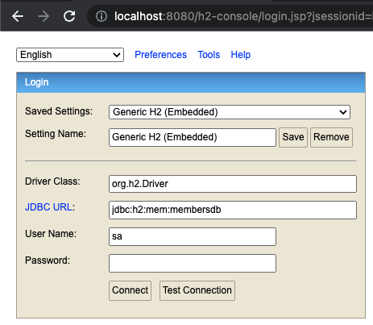
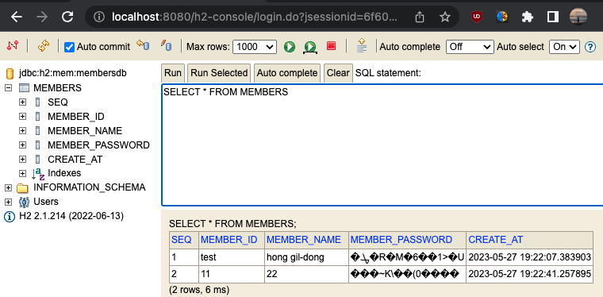

# member_springboot2.7_h2

## Introduction
멤버 데이터를 Database에 저장, 암호화된 비밀번호로 로그인을 구현한다.  
Data CRUD (Restful) 방식으로 API 구현하고,   
가입, 로그인 화면이 필요하여 MVC 방식에 템플릿 레이아웃 구성하였습니다. 

## Development Tools
- Apple MacBook M1 Pro (Ventura 13.3.1)
- IntelliJ IDEA 2023.1.2  

## Development Environment
- JAVA 11
- H2 (Database) 2.1.2146

## Application Version
- SpringBoot 2.7.11
- lombok 1.18.20
- Junit 5
- mockito 4.5.1
- mybaits 3.5.11
- thymeleaf 3.0.15

## APIs


## Views

| type | url |
|---|---|
|main | http://localhost:8080/ |  
|가입 | http://localhost:8080/join/form|
|로그인 | http://localhost:8080/login/form |
|리스트 | http://localhost:8080/members/list |
## 암호화

HASH  
http://h2database.com/html/functions.html#hash

## H2 Database 

### Database 접속  
http://localhost:8080/h2-console

jdbc:h2:mem:membersdb  
user : sa   
password :   



### Database 조회  
```
SELECT * FROM members
```



## mybatis

https://mybatis.org/spring-boot-starter/mybatis-spring-boot-autoconfigure/